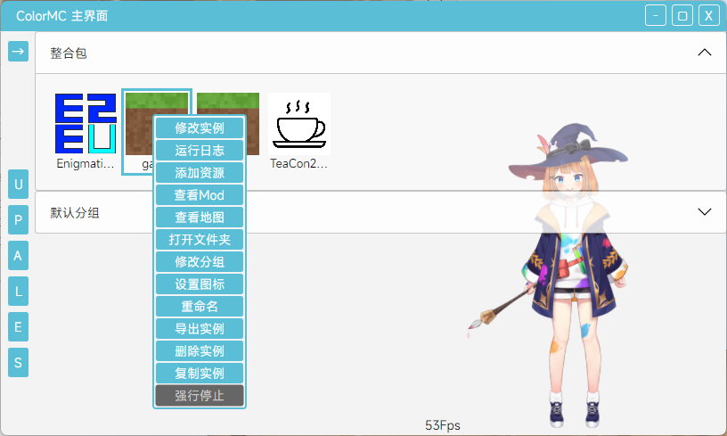
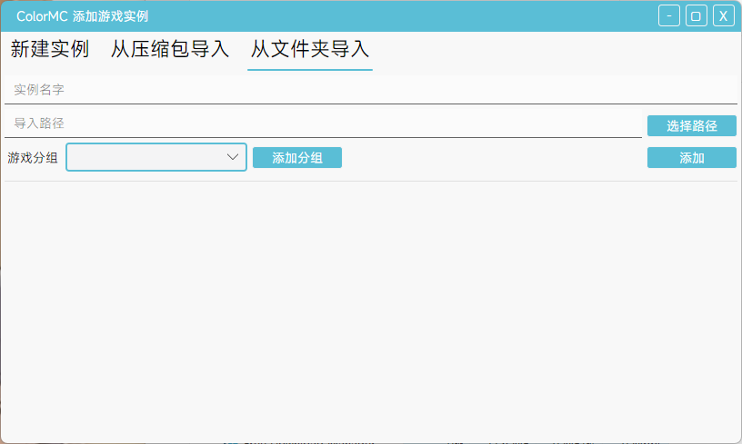
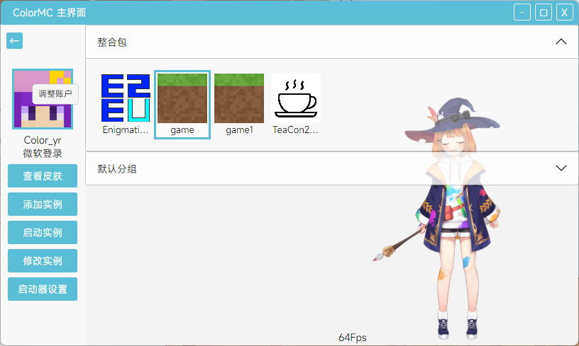
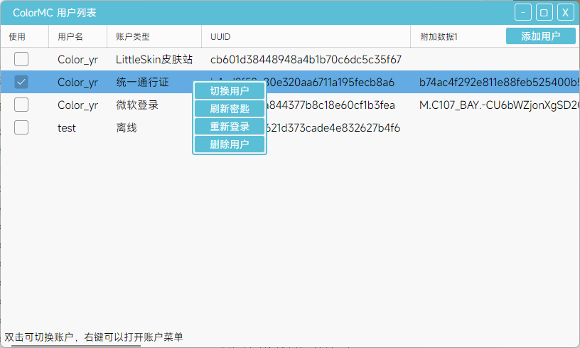

# ColorMC用户指南


## 目录

- [获取二进制文件](##获取二进制文件)
- [启动启动器](##启动启动器)
- [启动器运行路径](##启动器运行路径)
- [游戏实例与账户](##游戏实例与账户)
- [添加游戏实例](##添加游戏实例)
- [添加与选择账户](##添加与选择账户)
- [启动游戏实例](##启动游戏实例)
- [添加在线整合包](##添加在线整合包)

## 获取二进制文件

获取启动器二进制文件有3种方式

1. 从Github publish中获取
打开[ColorMC仓库](https://github.com/Coloryr/ColorMC)  
然后点击[Releases](https://github.com/Coloryr/ColorMC/releases)  
根据你的电脑系统选择下载
- windows系统下载win64
- linux系统.deb .pkg.tar.zst .AppImage
- macOs系统下载osx64

2. 从QQ群下载
加入群[571239090](http://qm.qq.com/cgi-bin/qm/qr?_wv=1027&k=iFEiL7JvAbPmM2E351SJlFk4UAHLx2yD&authKey=wyHTk7JbF8B47XYhvAQKmOcGTy3FQ%2FYA62hygi3J1x0KmZsfrlV%2B%2BK0iSyuxn3k1&noverify=0&group_code=571239090)或者[806493738](http://qm.qq.com/cgi-bin/qm/qr?_wv=1027&k=BK6-22zZvH5ERw8JMKqGCv2nVphhFUsf&authKey=eO1qaYSITVwLcarH8AqgZVYqqul7745D8a3aeBRsgss18unQgBKIMi8BpVEgPc0l&noverify=0&group_code=806493738)  
从群文件下载

3. 从源码里面构建
首先安装[dotnet sdk](https://dotnet.microsoft.com/en-us/download/dotnet)  
下载并安装.NET 7  
克隆代码
```
git clone https://github.com/Coloryr/ColorMC.git
cd ColorMC/src/ColorMC.Launcher
```
编译
```
dotnet build
```
完成后在文件夹`src\ColorMC.Launcher\bin\Debug\net7.0`可以获取到二进制

## 启动启动器

- windows和macOs系统，解压即可双击启动
- Linux系统安装包后可以在桌面或菜单中直接启动
AppImage可以直接启动

启动器启动后若有更新会提示下载并更新

## 启动器运行路径

- windows下，游戏会放在启动器根目录下  
账户储存会放在`C:\Users\{User}\AppData\Roaming\ColorMC`
- linux下，游戏和账户储存会放在`~/ColorMC`  
- macOs下，游戏放在`/Users/shared/ColorMC`  
账户储存会会放在`/Users/{User}/ColorMC`

启动器启动后会创建如下的文件夹结构
- download    下载缓存
- image       图片缓存
- java        下载的Java
- minecraft   游戏文件
  - assets         游戏资源文件
  - instances      游戏实例
  - libraries      游戏运行库
  - versions       游戏版本储存
- config.json   核心配置文件
- gui.json      GUI配置文件
- count.dat     游戏统计储存
- lock          启动器锁定
- logs.log      启动器日志
- maven.json    本地运行库信息

在账户文件夹只有一个`auth.json`文件，里面是账户数据

## 游戏实例

ColorMC是`多实例`游戏启动器，启动器是以`游戏实例`为单位启动游戏  
`游戏实例`相当于一个独立的游戏配置  
将Mod、配置、世界等储存在一个游戏文件夹  
使用多实例管理游戏可以将多个整合包放在一起，但又互不影响，但共享游戏资源文件和运行库，同时运行后可以不受其他游戏实例的干扰  

启动器主页面左侧会显示所有目前存在的游戏实例
  
每一个图标代表一个游戏实例，图标下面是游戏实例的名字  
点击游戏实例可以选择游戏实例，点击右键可以呼出实例菜单  
  

## 添加游戏实例

点击启动器主页面右侧的`添加实例`，可以打开新建实例窗口  
  


添加游戏实例有3种方式

1. 从头新建实例  
从头新建实例很简单，只需要填写实例名字，选择版本等信息，最后点击右下角的`添加`按键即可添加  
也可以从在线的整合包来添加实例  
点击`在线搜索整合包`可以打开此窗口

2. 从压缩包里导入实例  
  
从压缩包导入实例需要先选择压缩包，然后填写实例名字与选择压缩包类型，最后点击右下角的`导入压缩包`即可

3. 从现有的文件夹导入实例
  
从现有的文件夹导入实例需要先选择路径，然后填写实例名字，选择需要导入的文件内容，最后点击`添加`即可  
由于添加后缺失版本信息，因此需要手动选择游戏版本

## 账户

ColorMC的启动游戏实例需要一个`账户`，账户可以是以下几种类型
- 离线账户
- 微软账户
- 统一通行证账户
- LittleSkin皮肤站账户
- 自建皮肤站账户

注意：使用离线账户来启动游戏时，至少登录一个正版账户

添加游戏账户需要在主界面`点击头像`打开账户窗口  
  


窗口打开后，点击左侧的`A`即可添加账户  
  

双击账户列表中的账户可以切换账户
  

右键账户可以呼出菜单
  

## 启动游戏实例

在启动器左侧选择好需要启动的游戏实例  
  
选中时会有蓝色框进行包裹  
可以点击右边的`启动实例`按钮启动  
又或者双击需要启动的`游戏实例`

## 添加在线整合包
在添加实例的窗口内，点击添加整合包可以打开窗口
  
可以在上方的选择中筛选整合包等  
双击一个整合包可以打开版本选择  
  
再次双击可以开始下载整合包

在下载前若保持添加实例窗口开启  
整合包下载完成后会自动填入`实例名字`与`游戏分组`信息
